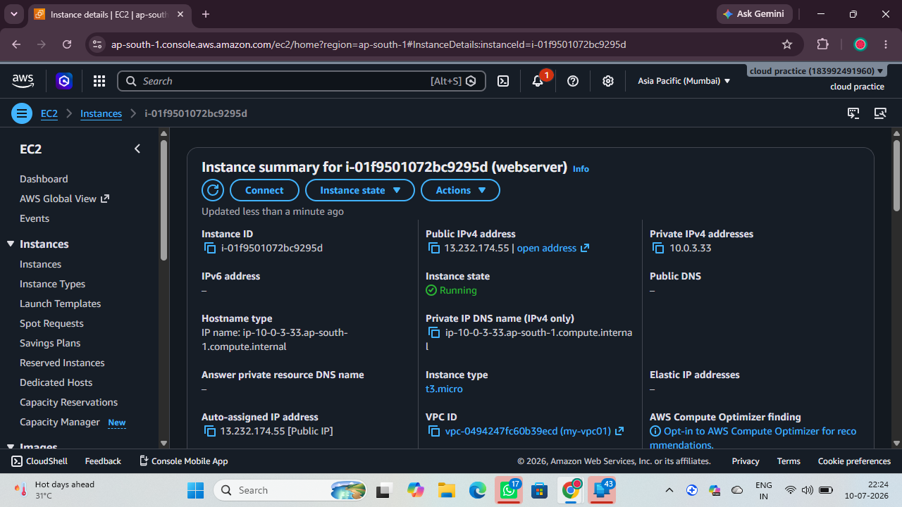
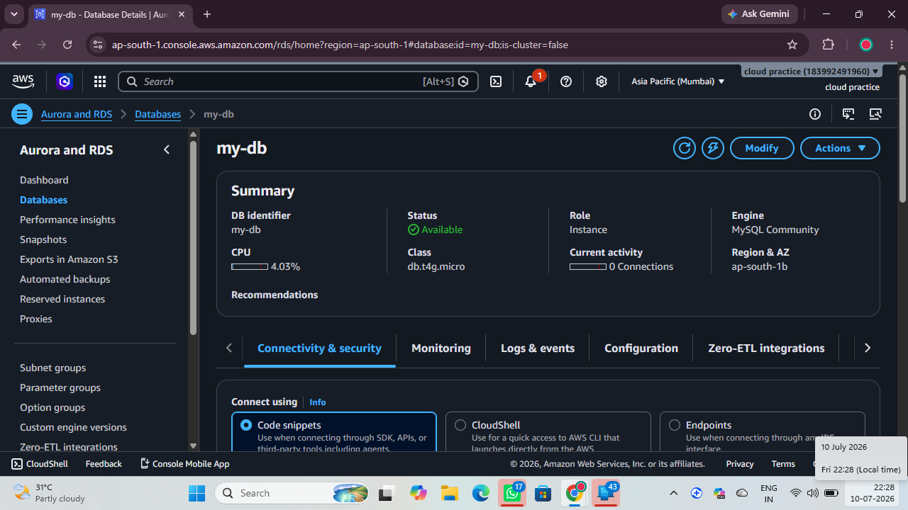
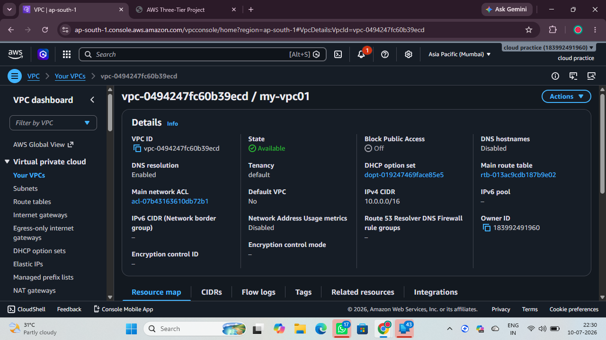

# ☁️ AWS Three-Tier Web Application Deployment


---

# 📌 Project Overview

This project demonstrates the deployment of a **Three-Tier Web Application** on **Amazon Web Services (AWS)** using highly available and scalable cloud infrastructure.

The architecture consists of:

- 🌐 Presentation Tier (EC2)
- ⚙️ Application Tier
- 🗄 Database Tier (Amazon RDS)

The application uses **Application Load Balancer**, **Auto Scaling**, **Amazon RDS**, and **Amazon VPC** to provide a secure and highly available environment.

---

# 🏗 AWS Architecture

```
                     Internet
                         │
                         ▼
            Application Load Balancer
                         │
          ┌──────────────┴──────────────┐
          │                             │
      EC2 Instance                  EC2 Instance
    (Auto Scaling)                (Auto Scaling)
          │                             │
          └──────────────┬──────────────┘
                         │
                     Amazon RDS
                      MySQL DB
```

---

# 🚀 AWS Services Used

| AWS Service | Purpose |
|-------------|---------|
| Amazon EC2 | Web Server |
| Amazon RDS | Database |
| Application Load Balancer | Load Balancing |
| Auto Scaling Group | Automatic Scaling |
| Amazon VPC | Network |
| Security Groups | Firewall |
| IAM | Identity Management |
| Internet Gateway | Internet Access |

---

# ✨ Features

- High Availability
- Auto Scaling
- Application Load Balancer
- Amazon RDS Database
- Secure VPC
- Public & Private Subnets
- Security Groups
- Fault Tolerance
- Scalable Architecture

---

# 🔄 Project Workflow

1. User accesses the application.
2. Request reaches the Application Load Balancer.
3. Load Balancer distributes traffic to EC2 instances.
4. Auto Scaling manages EC2 instances automatically.
5. EC2 connects securely to Amazon RDS.
6. Database returns the requested data.

---

# 📸 Project Screenshots


## 🌐 Website Home Page


---

## 💻 Amazon EC2 Instance



---


## ⚖️ Application Load Balancer


---


## 📈 Auto Scaling Group


---

## 🗄 Amazon RDS Database



---

## 🌍 Amazon VPC



---

# 🎯 Project Outcome

Successfully deployed a **Three-Tier Web Application** on AWS using:

- Amazon EC2
- Application Load Balancer
- Auto Scaling Group
- Amazon RDS
- Amazon VPC
- Security Groups
- IAM

### Benefits

- ✔ High Availability
- ✔ Scalability
- ✔ Secure Infrastructure
- ✔ Load Balancing
- ✔ Automatic Scaling
- ✔ Database Integration

---

# 📂 Repository Structure

```
AWS-THREETIER-WEBSITE-APPLICATION/
│
├── README.md
│
└── screenshots/
    ├── WEBSITEIMAGE.png
    ├── EC2.png
    ├── LOADBALANCER.png
    ├── AUTOSCALING.png
    ├── RDS.png
    └── VPC.png
```

---

# 👨‍💻 Author

**Manikandan S**

AWS Cloud Practitioner

GitHub: https://github.com/manikandansevu-cloud

LinkedIn: https://www.linkedin.com/in/YOUR-LINKEDIN/

---

## ⭐ If you found this project useful, please give it a Star!
